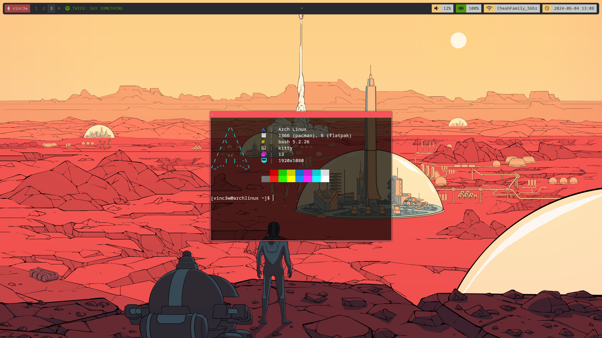
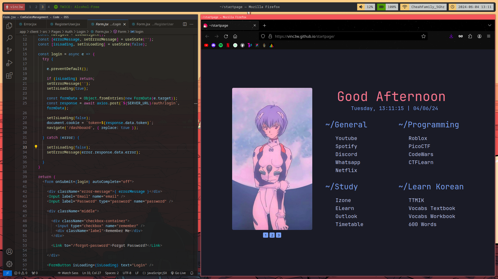

# Rice
This is my red themed rice. The color is built based on the wallpaper!

**If you like it, Please give me a starrrr. Thanks**

| Label         | Name               |
| ------------- | ------------------ |
| OS            | Arch Linux         |
| DE            | KDE Plasma X11     |
| WM            | i3                 |
| Terminal      | Kitty              |
| Font          | Default            |
| Bar           | Polybar            |
| Menu          | Rofi               |

## Screenshots





### Firefox StartPage
Inspired https://github.com/vinc3w/startpage
<br>
<br>

# Problem

### Polybar
When I make an application fullscreen, **bar/border** stays behind the application but not **bar/bar**:

**FullScreen** (opened white color image to show bar/border is behind and bar/bar is not)

**Not Fullscreen**

```ini
[bar/border]
; override-redirect = true
; wm-restack = i3

[bar/bar]
override-redirect = true
; wm-restack = i3
```

This can be fix to make both bars stay behind the application but when there are no application in full screen, it results in this:

**Behind**

```ini
[bar/border]
; override-redirect = true
; wm-restack = i3

[bar/bar]
override-redirect = true
wm-restack = i3
```

# Credits

### Rofi
Uses https://github.com/adi1090x/rofi<br>
- Type 1
- Style 11
- Yousai Color Theme

### Neofetch 
Uses https://github.com/chick2d/neofetch-themes<br>
Theme - SimpleFetch
